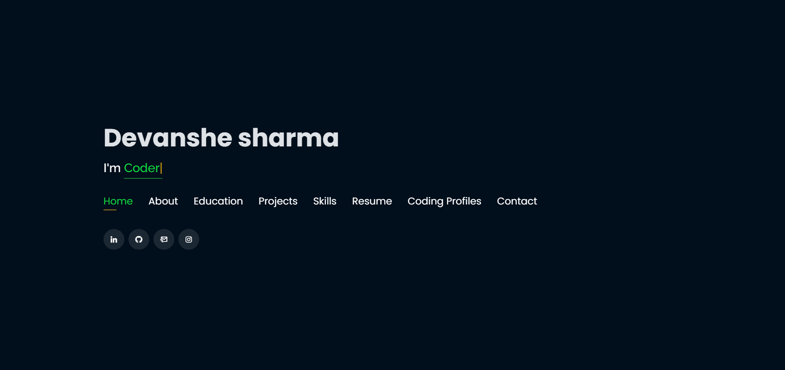

# Personal Portfolio 🔥

:star: Star me on GitHub — it helps!

### Website Preview
#### Home Page

#### About Page

  

## Features 📋
⚡️ Fully Responsive\
⚡️ Valid HTML5 & CSS3\
⚡️ Typing animation using `Typed.js`\
⚡️ Easy to modify

## Sections 📚
✔️ About\
✔️ Interests\
✔️ Education\
✔️ Online Certification\
✔️ Projects \
✔️ Skills \
✔️ Resume\
✔️ Coding Profile\
✔️ Contact Info

## Tools Used 🛠️
* <b>NETLIFY</b> - To host my static website (HTML, CSS, JS).

